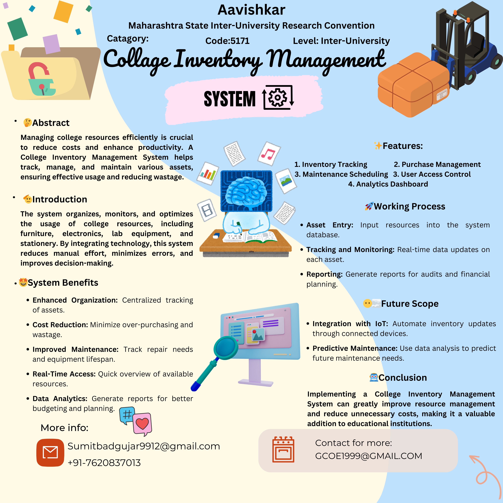
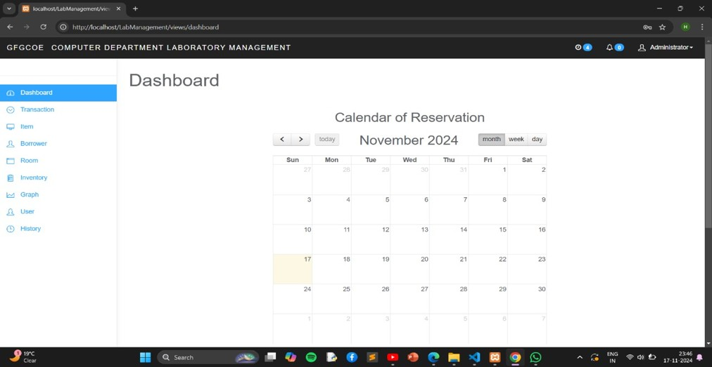
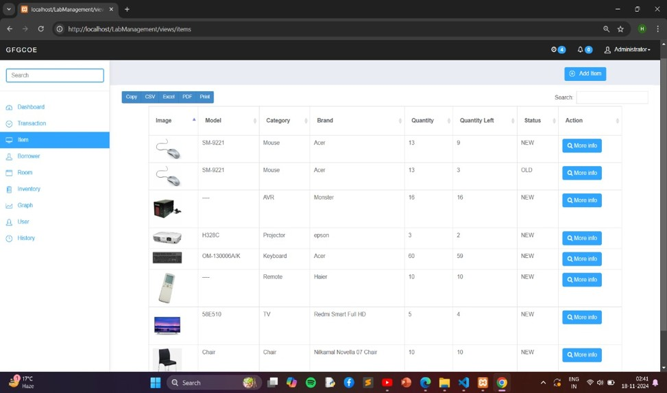
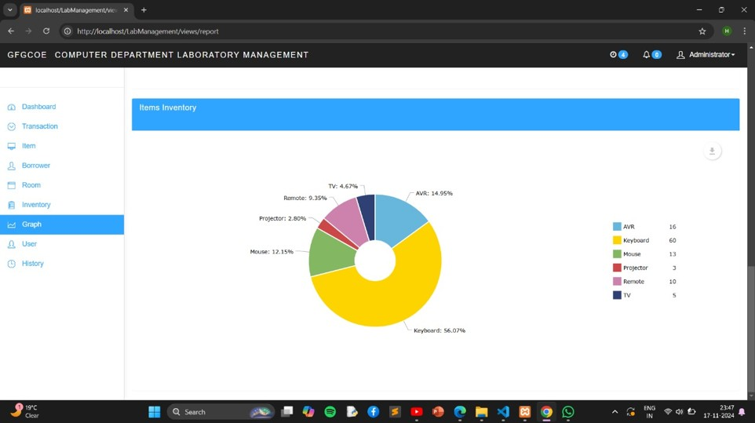
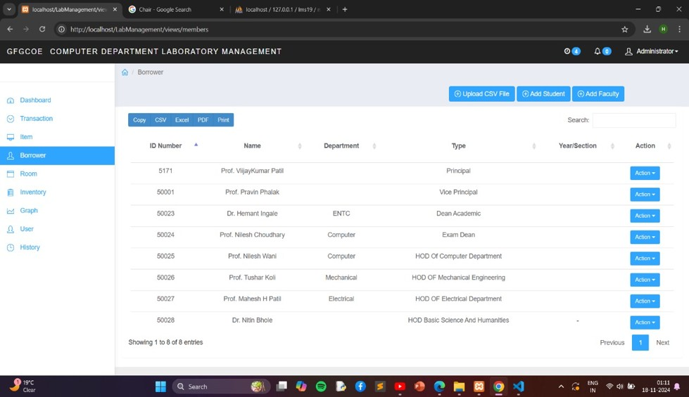
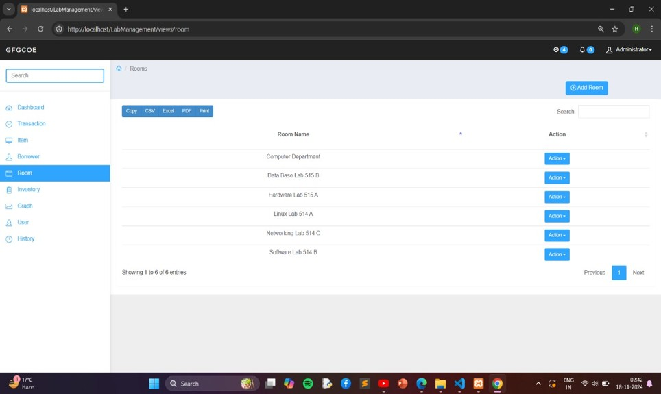

# Lab Management Project

## Project Overview
This project demonstrates a **College Lab Management system** with dashboard, inventory, and resource management features.

---

## 0️⃣ Design By Sumit Badgujar.
InventoryProject-Design
<p align="center">
  
</p>
---

## 1️⃣ Dashboard
<p align="center">
  
</p>

---

## 2️⃣ IM
<p align="center">
  
</p>

---

## 3️⃣ Inventory Item
<p align="center">
  
</p>

---

## 4️⃣ BM
<p align="center">
  
</p>

---

## 5️⃣ RM
<p align="center">
  
</p>

---

## 📌 Conclusion
This project demonstrates the **Lab Management System** with visual screenshots for dashboard, inventory, and resource management.

<!-- TREE_START -->

## 📂 Repository Structure

```
├── 📄 .htaccess (📅 2026-03-25, ⏳ 0d)
├── 📄 1_Dashboard.jpg (📅 2026-03-25, ⏳ 0d)
├── 📄 2_IM.jpg (📅 2026-03-25, ⏳ 0d)
├── 📄 3_inteventoryItem.jpg (📅 2026-03-25, ⏳ 0d)
├── 📄 4_BM.jpg (📅 2026-03-25, ⏳ 0d)
├── 📄 5_RM.jpg (📅 2026-03-25, ⏳ 0d)
├── 📄 Group Report.pdf (📅 2026-03-25, ⏳ 0d)
├── 📄 InventoryProject-Design.png (📅 2026-03-25, ⏳ 0d)
├── 📄 README.md (📅 2026-03-25, ⏳ 0d)
├── 📁 app/
├── 📁 Http/
├── 📁 Controllers/
├── 📄 DashboardController.php (📅 2026-03-25, ⏳ 0d)
├── 📄 EquipmentController.php (📅 2026-03-25, ⏳ 0d)
├── 📄 MaintenanceRecordController.php (📅 2026-03-25, ⏳ 0d)
├── 📄 ReservationController.php (📅 2026-03-25, ⏳ 0d)
├── 📁 Models/
├── 📄 Equipment.php (📅 2026-03-25, ⏳ 0d)
├── 📄 MaintenanceRecord.php (📅 2026-03-25, ⏳ 0d)
├── 📄 Reservation.php (📅 2026-03-25, ⏳ 0d)
├── 📄 User.php (📅 2026-03-25, ⏳ 0d)
├── 📁 background/
├── 📄 gcoe.jpg (📅 2026-03-25, ⏳ 0d)
├── 📁 class/
├── 📁 add/
├── 📄 add.php (📅 2026-03-25, ⏳ 0d)
├── 📁 config/
├── 📄 config.php (📅 2026-03-25, ⏳ 0d)
├── 📁 display/
├── 📄 display.php (📅 2026-03-25, ⏳ 0d)
├── 📁 edit/
├── 📄 edit.php (📅 2026-03-25, ⏳ 0d)
├── 📁 login/
├── 📄 login.php (📅 2026-03-25, ⏳ 0d)
├── 📁 logout/
├── 📄 logout.php (📅 2026-03-25, ⏳ 0d)
├── 📄 logout_member.php (📅 2026-03-25, ⏳ 0d)
├── 📄 college Inventory Management PPT.pptx (📅 2026-03-25, ⏳ 0d)
├── 📁 database/
├── 📁 migrations/
├── 📄 2024_01_01_000001_create_equipment_table.php (📅 2026-03-25, ⏳ 0d)
├── 📄 2024_01_01_000002_create_maintenance_records_table.php (📅 2026-03-25, ⏳ 0d)
├── 📄 2024_01_01_000003_create_reservations_table.php (📅 2026-03-25, ⏳ 0d)
├── 📁 img/
├── 📄 gcoe.jpg (📅 2026-03-25, ⏳ 0d)
├── 📄 index.php (📅 2026-03-25, ⏳ 0d)
├── 📄 lms19.sql (📅 2026-03-25, ⏳ 0d)
├── 📁 member/
├── 📄 footer.php (📅 2026-03-25, ⏳ 0d)
├── 📄 header.php (📅 2026-03-25, ⏳ 0d)
├── 📄 home.php (📅 2026-03-25, ⏳ 0d)
├── 📄 inbox.php (📅 2026-03-25, ⏳ 0d)
├── 📄 login.php (📅 2026-03-25, ⏳ 0d)
├── 📄 reserve_logs.php (📅 2026-03-25, ⏳ 0d)
├── 📄 session.php (📅 2026-03-25, ⏳ 0d)
├── 📄 signup.php (📅 2026-03-25, ⏳ 0d)
├── 📄 repo-tree.md (📅 2026-03-25, ⏳ 0d)
├── 📁 resources/
├── 📁 views/
├── 📁 components/
├── 📄 application-logo.blade.php (📅 2026-03-25, ⏳ 0d)
├── 📄 dashboard.blade.php (📅 2026-03-25, ⏳ 0d)
├── 📁 equipment/
├── 📄 create.blade.php (📅 2026-03-25, ⏳ 0d)
├── 📄 edit.blade.php (📅 2026-03-25, ⏳ 0d)
├── 📄 index.blade.php (📅 2026-03-25, ⏳ 0d)
├── 📄 show.blade.php (📅 2026-03-25, ⏳ 0d)
├── 📁 layouts/
├── 📄 app.blade.php (📅 2026-03-25, ⏳ 0d)
├── 📁 maintenance-records/
├── 📄 form.blade.php (📅 2026-03-25, ⏳ 0d)
├── 📄 index.blade.php (📅 2026-03-25, ⏳ 0d)
├── 📄 show.blade.php (📅 2026-03-25, ⏳ 0d)
├── 📁 routes/
├── 📄 auth.php (📅 2026-03-25, ⏳ 0d)
├── 📄 web.php (📅 2026-03-25, ⏳ 0d)
├── 📁 styles/
├── 📄 login.css (📅 2026-03-25, ⏳ 0d)
├── 📄 unused-files.json (📅 2026-03-25, ⏳ 0d)
├── 📁 uploads/
├── 📄 1487309332.jpg (📅 2026-03-25, ⏳ 0d)
├── 📄 1487312016.jpg (📅 2026-03-25, ⏳ 0d)
├── 📄 1487646917.jpg (📅 2026-03-25, ⏳ 0d)
├── 📄 1487647220.jpg (📅 2026-03-25, ⏳ 0d)
├── 📄 1487647452.jpg (📅 2026-03-25, ⏳ 0d)
├── 📄 1487647676.png (📅 2026-03-25, ⏳ 0d)
├── 📄 1487647678.png (📅 2026-03-25, ⏳ 0d)
├── 📄 1487647679.png (📅 2026-03-25, ⏳ 0d)
├── 📄 1487647680.png (📅 2026-03-25, ⏳ 0d)
├── 📄 1487647681.png (📅 2026-03-25, ⏳ 0d)
├── 📄 1487647684.png (📅 2026-03-25, ⏳ 0d)
├── 📄 1487647878.jpg (📅 2026-03-25, ⏳ 0d)
├── 📄 1487648107.jpg (📅 2026-03-25, ⏳ 0d)
├── 📄 1614396075.png (📅 2026-03-25, ⏳ 0d)
├── 📁 ITEMS/
├── 📄 -font-b-Haier-b-font-font-b-air-b-font-font-b-conditioner-b-font.jpg (📅 2026-03-25, ⏳ 0d)
├── 📄 1346577_090710084150_Heater__Aircon_Universal_Remote_image11215.jpg (📅 2026-03-25, ⏳ 0d)
├── 📄 41VpBQDispL.jpg (📅 2026-03-25, ⏳ 0d)
├── 📄 482782-audioengine-5.jpg (📅 2026-03-25, ⏳ 0d)
├── 📄 5530.jpg (📅 2026-03-25, ⏳ 0d)
├── 📄 591758.jpg (📅 2026-03-25, ⏳ 0d)
├── 📄 71OFFI4WTDL._SL1500_.jpg (📅 2026-03-25, ⏳ 0d)
├── 📄 81hcJyCQziL._SL1500_.jpg (📅 2026-03-25, ⏳ 0d)
├── 📄 8738314211640p.jpg (📅 2026-03-25, ⏳ 0d)
├── 📄 9.jpg (📅 2026-03-25, ⏳ 0d)
├── 📄 91VyBNlibLL._SL1500_.jpg (📅 2026-03-25, ⏳ 0d)
├── 📄 AC-remote.jpg (📅 2026-03-25, ⏳ 0d)
├── 📄 AllinOneDELL20Win8.jpg (📅 2026-03-25, ⏳ 0d)
├── 📄 D_iStock_000007207702Medium.jpg (📅 2026-03-25, ⏳ 0d)
├── 📄 G6550WU_front-beauty.jpg (📅 2026-03-25, ⏳ 0d)
├── 📄 IMG_9345.png (📅 2026-03-25, ⏳ 0d)
├── 📄 SM-3330WH_blank.jpg (📅 2026-03-25, ⏳ 0d)
├── 📄 Thumbs.db (📅 2026-03-25, ⏳ 0d)
├── 📄 gallery-1462307309-logitech-z150-speakers.jpg (📅 2026-03-25, ⏳ 0d)
├── 📄 gsmarena_002.jpg (📅 2026-03-25, ⏳ 0d)
├── 📄 keyboard-test-cases.png (📅 2026-03-25, ⏳ 0d)
├── 📄 medium-02.jpg (📅 2026-03-25, ⏳ 0d)
├── 📄 optiplex-9010-all-in-on-100004751-orig.jpg (📅 2026-03-25, ⏳ 0d)
├── 📄 secure-500w-high-performance-avr-3084-613002-1-product.jpg (📅 2026-03-25, ⏳ 0d)
├── 📄 secure-svc-500va-servo-timedelay.jpg (📅 2026-03-25, ⏳ 0d)
├── 📁 views/
├── 📄 borrow.php (📅 2026-03-25, ⏳ 0d)
├── 📄 dashboard.php (📅 2026-03-25, ⏳ 0d)
├── 📄 footer.php (📅 2026-03-25, ⏳ 0d)
├── 📄 header.php (📅 2026-03-25, ⏳ 0d)
├── 📄 history.php (📅 2026-03-25, ⏳ 0d)
├── 📄 include_history.php (📅 2026-03-25, ⏳ 0d)
├── 📄 inventory.php (📅 2026-03-25, ⏳ 0d)
├── 📄 items.php (📅 2026-03-25, ⏳ 0d)
├── 📄 items_info.php (📅 2026-03-25, ⏳ 0d)
├── 📄 member_profile.php (📅 2026-03-25, ⏳ 0d)
├── 📄 members.php (📅 2026-03-25, ⏳ 0d)
├── 📄 new.php (📅 2026-03-25, ⏳ 0d)
├── 📄 printBorrow.php (📅 2026-03-25, ⏳ 0d)
├── 📄 report.php (📅 2026-03-25, ⏳ 0d)
├── 📄 reservation.php (📅 2026-03-25, ⏳ 0d)
├── 📄 return.php (📅 2026-03-25, ⏳ 0d)
├── 📄 room.php (📅 2026-03-25, ⏳ 0d)
├── 📄 room_info.php (📅 2026-03-25, ⏳ 0d)
├── 📄 session.php (📅 2026-03-25, ⏳ 0d)
├── 📄 setting.php (📅 2026-03-25, ⏳ 0d)
├── 📄 user.php (📅 2026-03-25, ⏳ 0d)
├── 📄 user_profile.php (📅 2026-03-25, ⏳ 0d)
├── 📄 viewmonth.php (📅 2026-03-25, ⏳ 0d)

```

<!-- TREE_END -->
